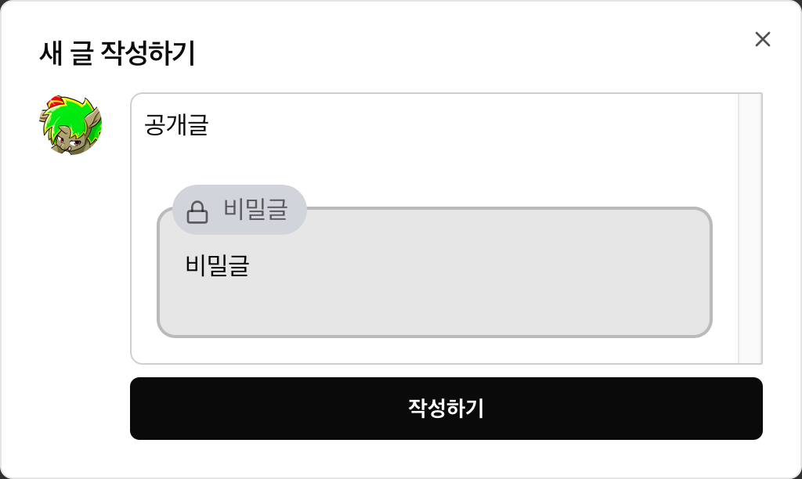
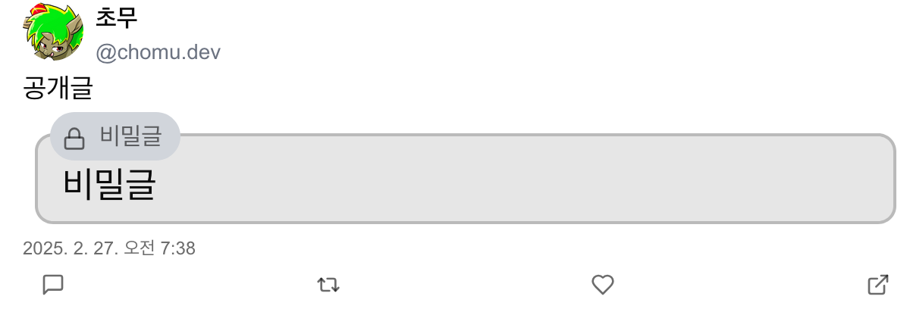

# Secret Sky

[Secret Sky](https://secret-sky.vercel.app)는 SNS [Bluesky](https://bsky.app)에 추가 기능을 제공하는 서드 파티 프론트엔드 애플리케이션입니다.

## 개요

Bluesky는 모든 글이 기본적으로 공개되는 SNS 서비스지만, 일부 사용자들은 자신만의 비밀 공간을 갖고 싶어했어요. 이를 위해 만들어진 Secret Sky입니다! Secret Sky를 이용하면 비밀글을 안전하게 작성하고, 선택한 사용자만 그 글을 볼 수 있습니다. 이제 여러분도 Secret Sky와 함께 더욱 특별하고 자유로운 소통을 경험해보세요!

## 주요 기능

- **비밀글:** 공개글과 비밀글 모두 지원하며, 암호화된 콘텐츠를 API를 통해 지정된 공개 범위 내 사용자에게만 복호화하여 표시합니다.
- **피드 및 타임라인:** 팔로잉 피드, 목록 피드 등 다양한 피드를 제공하며, 무한 스크롤 및 갱신 기능을 포함합니다.
- **상호작용 기능:** 좋아요, 재개시, 멘션 등 기본 SNS 상호작용을 지원합니다.
- **미디어 임베드:** 이미지, 비디오 등 미디어 콘텐츠를 원활하게 표시합니다.

### 비밀글

Secret Sky 의 주 기능은 이름에서도 알 수 있듯이 비밀글 작성 기능입니다. 사용자가 비밀글을 작성하면 해당 글은 암호화되어 암호문은 Bsky에, 키는 Secret Sky DB에 저장됩니다. 이후 열람 권한이 있는 사용자가 해당 글을 열람하면 API를 통해 암호문과 키를 받아 복호화하여 표시합니다.

1. 비밀글 작성
   
   로그인 후 루트 페이지 `/` 타임라인에서 우측 하단의 글쓰기 버튼을 클릭하면 글을 작성할 수 있는 모달이 나타납니다. 여기서 비밀글 부분에 글을 작성하면 비밀글이 작성됩니다.

2. 권한을 가진 사용자가 열람
   
   권한을 가진 사용자가 해당 글을 열람하면 복호화된 글이 표시됩니다.

3. 권한이 없는 사용자가 열람
   
   권한이 없는 사용자가 해당 글을 열람하면 복호화된 글이 표시되지 않습니다. 또한 일부 상호작용도 제한 됩니다.

열람 권한은 댓글 작성 권한과 동일하며, 작성자에 의해 언제든 변경될 수 있습니다. 암호화된 내용은 Bluesky 에 저장되므로 해당 글을 Bluesky 에서 제거하면 Secret Sky 서버 관리자도 본문을 알 수 없기에 작성자가 글의 통제권을 유지할 수 있습니다.

## 설치 및 실행

1. **의존성 설치:** 프로젝트 루트에서 다음 명령어를 실행합니다.

   ```sh
   yarn
   ```

2. **개발 서버 실행**: 아래 명령어로 개발 서버를 시작합니다.

   ```sh
   yarn dev
   ```

3. **빌드 및 실행**: 아래 명령어로 빌드 및 실행합니다.
   ```sh
   yarn build
   yarn start
   ```

## 기술 스택

- **Next.js**: SSR 및 SSG를 활용한 React 프레임워크
- **React**: UI 렌더링 라이브러리
- **TypeScript**: 타입 안전성 및 코드 가독성
- **Prisma**: 데이터베이스 ORM, PostgreSQL 연동
- **zustand**: 전역 상태 관리
- **Tailwind CSS**: UI 스타일링 도구
- **shadcn/ui**: UI 컴포넌트 라이브러리

## 서비스

- **Vercel**: 배포 및 호스팅
- **Supabase**: 암호 키 데이터베이스 관리

## 프로젝트 구조

프로젝트는 다음과 같은 디렉토리 구조로 구성되어 있습니다.

- `app/`: Next.js 라우트 및 서버 사이드 코드
- `components/`: 재사용 가능한 UI 컴포넌트
- `actions/`: 서버 액션 및 API 호출 로직
- `lib/`: 유틸리티, API 호출 및 암호화 관련 코드
- `prisma/`: Prisma 스키마 및 데이터베이스 관련 파일
- `hooks/`: 커스텀 React Hooks
- `context/`: 전역 상태 관리
